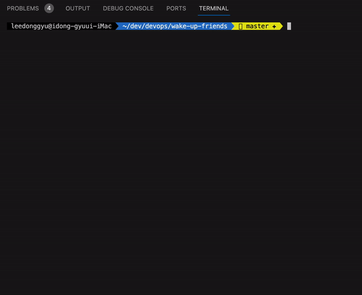
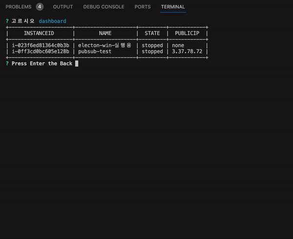
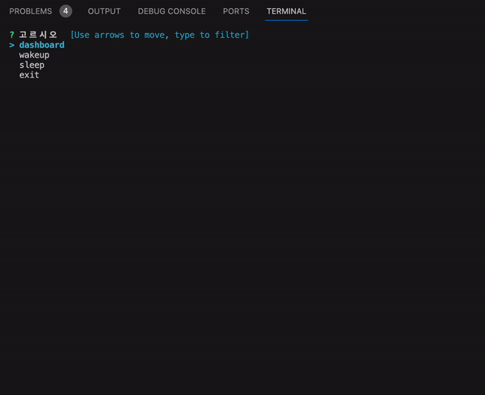

# Wake-up-Friends

## Desc
- AWS Console 들어가서 EC2 인스턴스를 Running / Stopped 하기 귀찮음
- 그냥 보고 깨우자 (Running)

## Required

- AWS Configure default 로 설정이 되있어야 한다.
- Region 명시 되어있어야 한다.

## Exec 

```sh
    ## use go file
    make dev

    ## use bin
    make run
```

## 구성

```sh
    ## 명령어 바로 실행하기 
    make build
    mv /usr/local/bin ./bin/friends
    friends

    ## 명령어 실행
    ## profile : 기본값은 default
    ## region : 기본값은 ap-northeast-2
    friends -p [profile] -r [region]
    
    ## ex1) profile : default, region : ap-northeast-2
    friends 

    ## ex2) profile : leedonggyu, region : us-east-1
    friends -p leedonggyu -r us-east-1
```

## 기능

- Dashboard



- Wakeup



- Sleep

